#Daft Punk Tribute:
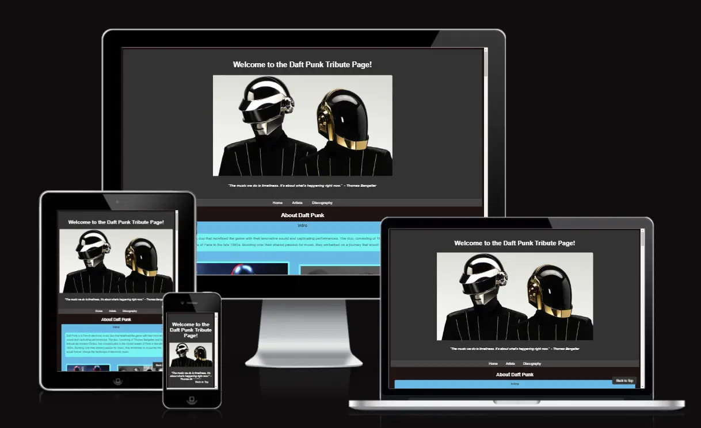

##User Experience (UX)

###Initial Discussion:

The Daft Punk Tribute project aims to create a website paying homage to the iconic electronic band Daft Punk. The primary goal is to provide fans and enthusiasts with a comprehensive platform to explore the band's discography, learn about its members, and appreciate their contributions to electronic music.

###User Stories:

As a fan of Daft Punk, I want to easily navigate through the website to access information about the band's discography.
As a user, I want to learn more about each member of Daft Punk and their individual contributions to the band.
As a music enthusiast, I want to watch videos and listen to songs from Daft Punk's albums directly on the website.
As a visitor, I want the website to be visually appealing and easy to use on both desktop and mobile devices.

##Design

###Colour Scheme:

The website's colour scheme predominantly features dark backgrounds with contrasting text colours, creating a visually striking and immersive experience reminiscent of electronic music aesthetics. Vibrant accent colours are used sparingly to highlight important elements and calls to action.
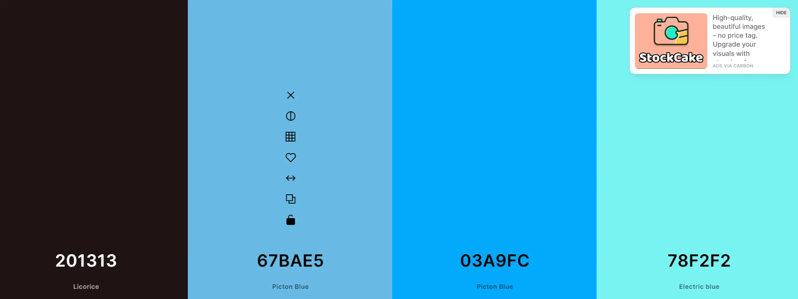
Typography:
The chosen font, Arial, is a clean and legible sans-serif typeface that ensures readability across various screen sizes. It complements the modern and sleek design aesthetic of the website.

###Imagery:

High-quality imagery, including album covers and artist photos, is used throughout the website to enhance visual appeal and provide context to the content. Images are carefully selected to evoke the essence of Daft Punk's iconic style and music.

###Wireframes:

Wireframes were created to plan the layout and structure of each page, ensuring a logical flow of information and a consistent user experience across the website.

##Features

###All Pages: 

-Consistent navigation bar for easy access to all sections.

-Footer with contact email.
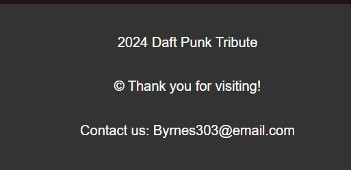

-Back to Top Button 

###Index Page:

-Hero section showcasing Daft Punk's image and brief introduction.
-timeline highlighting key milestones in their career.
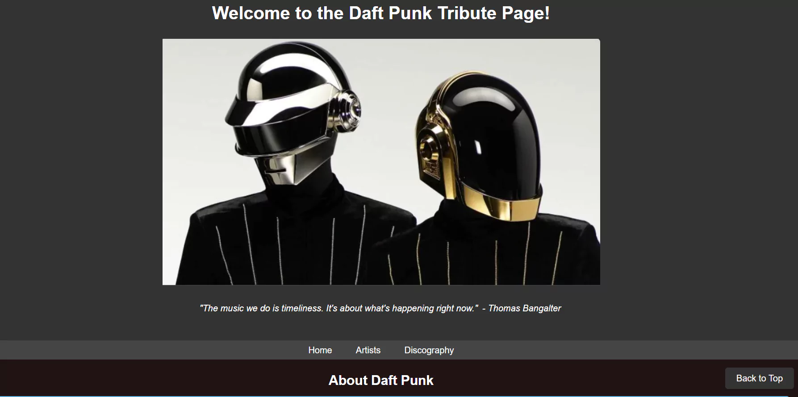

###Artist Page

-Detailed biography of Daft Punk members.
-Images featuring iconic images of the duo.
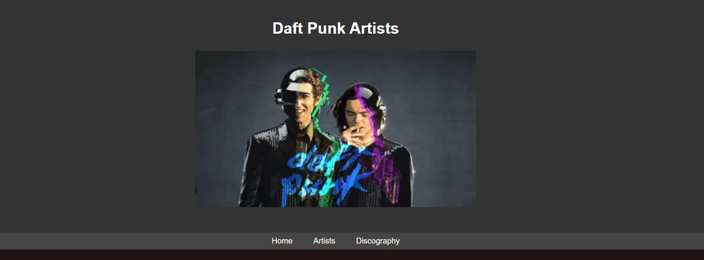
Discography Page:

-Comprehensive list of Daft Punk's albums and singles.
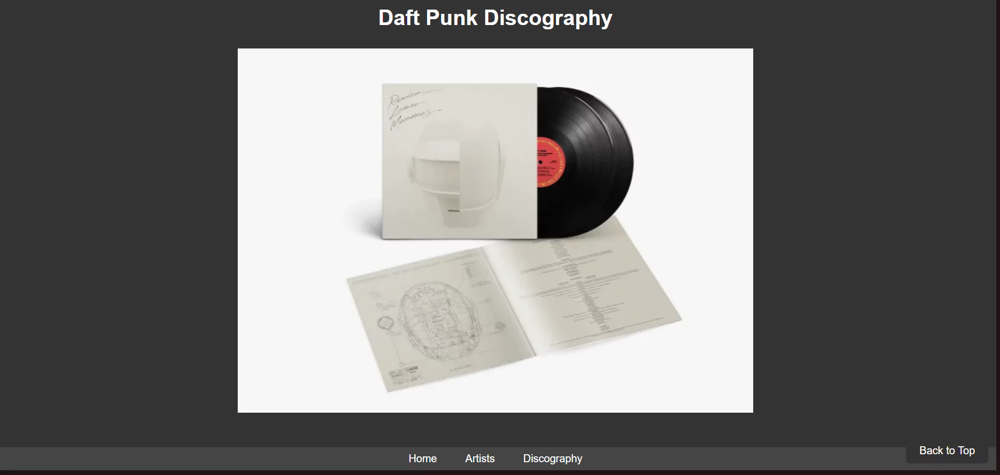

##Accessibility:

-Semantic HTML elements for improved accessibility.
-Descriptive alt attributes for images.
-Ensured sufficient colour contrast for readability.

###Languages Used:

-HTML5
-CSS3

###Frameworks, Libraries & Programs Used:

-None

##Deployment & Local Development:

##Deployment:

The site was deployed to GitHub pages. The steps to deploy are as follows:
-In the GitHub repository, navigate to the Settings tab
-From the source section drop-down menu, select the Master Branch
-Once the master branch has been selected, the page will be automatically refreshed with a -detailed ribbon display to indicate the successful deployment.

###Testing:

W3C Validator:
-The HTML and CSS code were validated using the W3C Validator to ensure compliance with web standards.
-W3C HTML Validator test: 
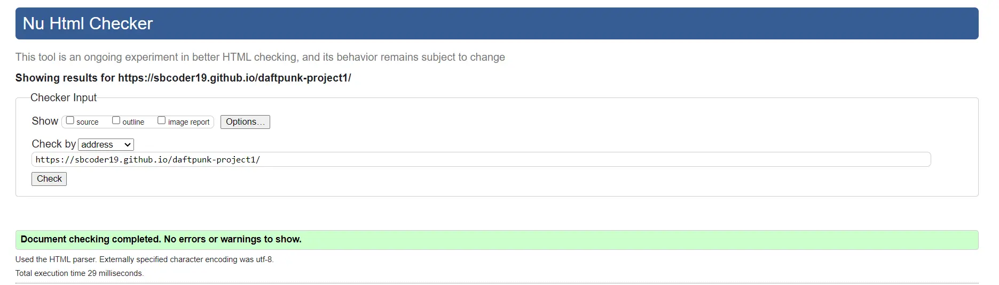
-w3c CSS Validator test: 
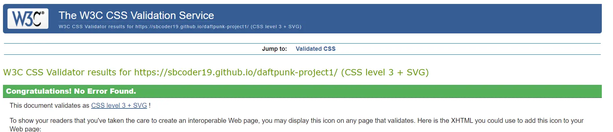

###Solved Bugs
No bugs were encountered during development.

###Known Bugs
No known bugs at the time of deployment.

###Testing User Stories:
-User stories were tested manually to ensure all features functioned as expected and provided a satisfactory user experience.

##Lighthouse:
###Index Page: 

Mobile: Performance score of 65, Accessibility score of 100, Best Practices score of 78.
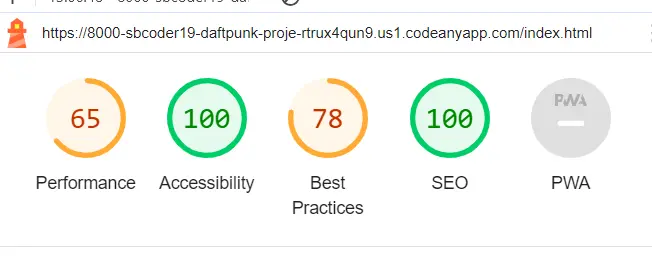

Desktop: Performance score of 84, Accessibility score of 100, Best Practices score of 78.
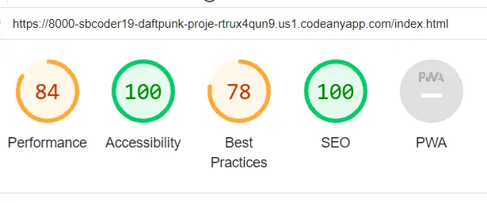

###Artists Page:

Mobile: Performance score of 100, Accessibility score of 100, Best Practices score of 100.
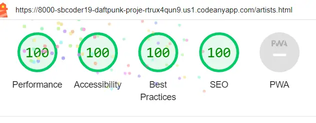

Desktop: Performance score of 100, Accessibility score of 100, Best Practices score of 100.
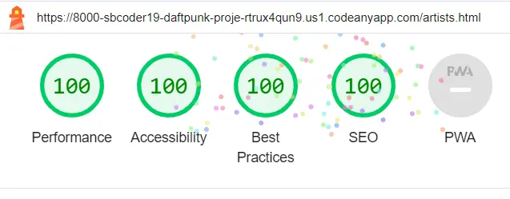

###Discography Page:

Mobile: Performance score of 68, Accessibility score of 92, Best Practices score of 74.
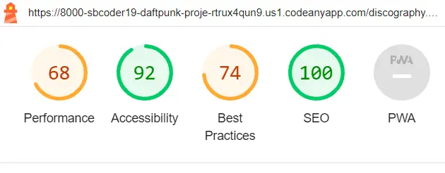

Desktop: Performance score of 64, Accessibility score of 92, Best Practices score of 78.

##Credits:

###Code Used:

-No external code snippets used.

###Content

-All written content is original.

###Media:

-Album covers and artist photos sourced from official Daft Punk channels.

##Acknowledgments:

-Special thanks to Daft Punk for their groundbreaking contributions to electronic music.